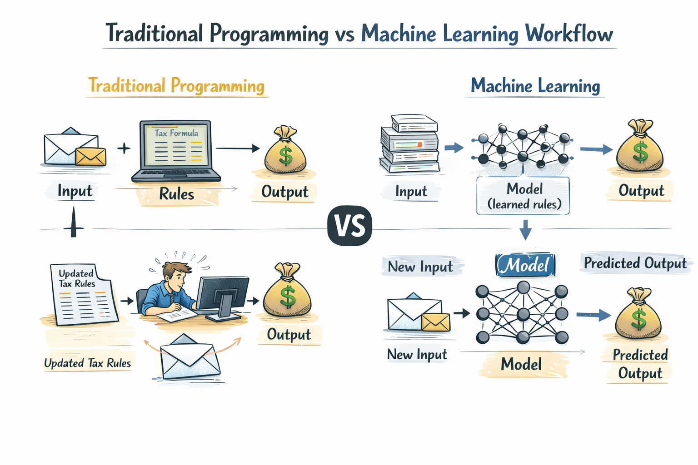
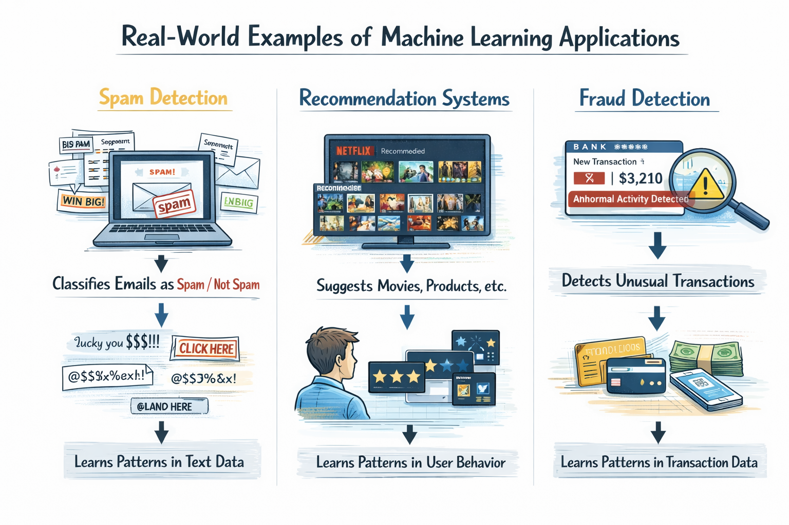
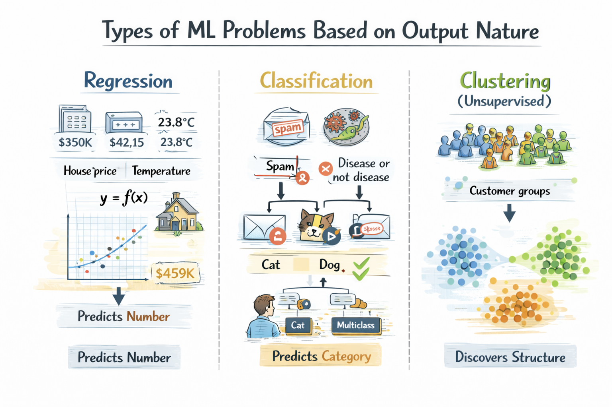
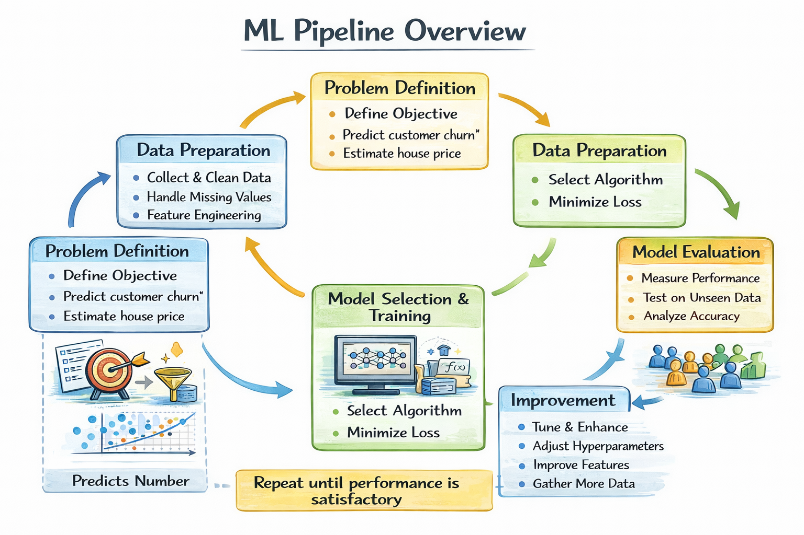

## Introduction to Machine Learning

- What machine learning really is (learning patterns from data, not rule-based systems)
- Traditional programming vs machine learning workflow
- Real-world examples: spam detection, recommendation systems, fraud detection
- Types of ML problems based on output nature
- ML pipeline overview (problem → model → evaluation → improvement)
- Where ML fits in AI, Data Science, and Software Engineering

---

# What Machine Learning Really Is

**Machine Learning** is a way for computers to learn from data instead of following fixed instructions written by humans. In traditional programming, we write exact **step-by-step rules** for every situation. If the rules change, we must rewrite the program. Machine learning reduces this dependency on **hard-coded rules**.

In machine learning, we do not directly write rules. Instead, we provide **data examples**. The system studies this data, identifies **patterns**, and builds its own internal logic. This learned logic is stored inside a **model**, not inside long chains of if-else conditions. The model represents mathematical relationships learned from the data.

Consider the example of **spam detection**. If we try to write rules like “if the email contains this word, mark it as spam,” the system will fail quickly because spammers constantly change their words and strategies. Instead, machine learning analyzes thousands of emails and learns common **patterns**, such as word combinations, frequency of terms, structure, and hidden relationships. It does not memorize emails. It learns generalizable patterns that help it classify new emails correctly.

The central idea of machine learning is learning the **relationship between input and output**. Inputs are the known variables, such as house size, number of rooms, or email text. Outputs are what we want to predict, such as house price or whether an email is spam. The model learns how inputs are mathematically connected to outputs. This learned relationship is called a **mapping function**.

Another important concept is **adaptability**. A traditional program does not improve unless a developer manually updates it. A machine learning model can improve by learning from **more data**. When trained properly, increasing high-quality data usually improves the model’s ability to capture patterns accurately.

Machine learning is not magic and it is not human intelligence. It does not “think” or “understand.” It performs **mathematical computations** to detect patterns in historical data and uses those patterns to make predictions on **unseen data**. The intelligence comes from mathematics and statistics, not consciousness.

At its core, machine learning answers one powerful question:

Given past data, can we **predict or make decisions** about new or future data?

If the problem involves prediction, pattern recognition, or data-driven decision making, then machine learning is the right tool.

# Traditional Programming vs Machine Learning Workflow

In **traditional programming**, the workflow is straightforward. We provide **input data** and write explicit **rules**. The computer applies those rules to the input and produces the **output**. Everything depends on the logic written by the programmer.

> The structure is:  
> **Input + Rules → Output**

For example, consider tax calculation. We define exact formulas. If income falls in a certain range, apply a specific percentage. If tax laws change, we update the rules manually. The intelligence lies in the **human-written logic**, not in the data.

Now look at **Machine Learning**. The workflow is fundamentally different. Instead of writing rules, we provide **input data** along with the **correct output examples**. The system uses mathematics and optimization techniques to discover the hidden rules on its own. These discovered rules are stored inside a **model**.

> The learning structure becomes:  
> **Input + Output → Model (learned rules)**

> After training, the workflow changes to:  
> **New Input → Model → Predicted Output**

This shift is extremely important.

In traditional programming, **humans create logic**.  

In machine learning, **data creates logic**.

Another major difference is handling **complexity**. When the relationship between input and output is simple and clearly defined, traditional programming works perfectly. But when relationships become highly complex, such as **face recognition**, **speech recognition**, or **risk prediction**, writing explicit rules becomes nearly impossible. Machine learning handles such problems using **mathematical optimization** and pattern discovery.

Responsibility also shifts. In traditional programming, if the output is wrong, the developer debugs and fixes the logic. In machine learning, if predictions are wrong, we improve the **training data**, select a better **model**, engineer better **features**, or tune **hyperparameters**. We do not manually rewrite rules.

Machine learning is most powerful when patterns are too complicated to express as clear step-by-step instructions.

> So remember this clearly:  
> Traditional programming is **rule-driven**.  
> Machine learning is **data-driven**.

# Real-World Examples: Spam Detection, Recommendation Systems, Fraud Detection

Machine learning becomes truly clear when we observe where it is applied in real life. It is not just about formulas or algorithms. It is operating silently in many systems you use every day.

Let us begin with **spam detection**.

When your email automatically filters unwanted messages into the spam folder, that is **Machine Learning** working in the background. The system has been trained on millions of emails labeled as **“spam”** and **“not spam.”** From this labeled data, it learns statistical patterns. These patterns may include unusual word combinations, suspicious links, strange formatting, excessive capital letters, or abnormal frequency of certain terms.

Engineers do not manually write rules like “if this exact sentence appears, mark it as spam.” Such rules would fail quickly because spam strategies constantly change. Instead, the model learns **probabilities**. When a new email arrives, the model calculates how similar it is to previously observed spam emails. If the **probability score** crosses a certain **threshold**, the email is classified as spam.

Now consider **recommendation systems**.

When platforms like Netflix suggest movies or Amazon recommends products, machine learning is again at work. The system studies your past behavior — what you clicked, what you watched completely, what you rated highly, and what you ignored. It also compares your behavior with other users who show similar patterns.

If many users with behavior similar to yours enjoyed a particular movie, the system predicts that you may also like it. This is not random guessing. It is pattern discovery based on **user behavior data**. Mathematically, this often involves analyzing large **user–item interaction matrices**, but conceptually it is simple: learn from past behavior to predict future preferences.

Now think about **fraud detection** in banking systems.

Fraud patterns constantly evolve. Writing rigid rules such as “if transaction amount is above X, block it” would create many false alarms and inconvenience genuine customers. Instead, machine learning models learn a customer’s **normal transaction behavior** over time.

If a transaction suddenly appears unusual — such as a different country, unusual spending amount, or abnormal time of purchase — the model calculates a **fraud probability score**. If that score exceeds a defined threshold, the transaction is flagged for review.

Notice the common principle in all three cases.

The system is not memorizing exact past examples. It is learning **patterns** and **generalizing** them to new, unseen data.

Spam detection learns patterns in **text data**.  

Recommendation systems learn patterns in **user behavior**.  

Fraud detection learns patterns in **transaction data**.

This is the core idea of machine learning. It analyzes historical data, extracts **mathematical relationships**, and uses those relationships to make predictions or decisions on new data.

# Types of ML Problems Based on Output Nature

The simplest way to understand machine learning problems is by looking at the **type of output** we want to predict. The output defines the problem, not the input. Always remember this principle.

If the output is a **number**, the problem is called **Regression**.

In regression, the model predicts a **continuous value**. Examples include predicting house price, sales revenue, temperature, stock value, or insurance premium. These outputs are not limited to fixed categories. They can take decimal values like 10.5, 200.75, or 99999.99. The model’s objective is to estimate a quantity as accurately as possible.

Mathematically, regression learns a function:

**$y = f(x)$**

where **y is continuous** and depends on input variables x.

Now consider situations where the output is a **category** instead of a number. This type of problem is called **Classification**.

Examples include spam or not spam, fraud or not fraud, pass or fail, disease present or not present. In these cases, the output belongs to a fixed set of classes. The model assigns an input to one of these categories.

If there are only two possible classes, it is called **Binary Classification**.  

If there are more than two classes, such as classifying an image into cat, dog, or horse, it is called **Multiclass Classification**.

Even though classification models internally calculate **probabilities**, the final output is a **class label**, not a continuous number.

There is another important scenario where we do not have labeled outputs at all. We only have input data and want to discover hidden structure within it. This type of problem is called **Clustering**, which belongs to **Unsupervised Learning**.

For example, grouping customers based on buying behavior. There is no predefined “correct answer.” The model identifies patterns of similarity and forms groups automatically. The output is a **cluster assignment**, not a known category or numeric value.

> **So based on output nature, machine learning problems can be understood as:\**
> If output is continuous → **Regression.**  
> If output is categorical → **Classification.**  
> If output is hidden structure without labels → **Clustering.**

This distinction is extremely important because it determines which **algorithms**, **loss functions**, and **evaluation metrics** we should use.

Before choosing any model, always ask one clear question:

Am I trying to predict a **number**, a **category**, or discover a **hidden structure**?

The answer to this question guides the entire machine learning approach.

# ML Pipeline Overview

**Machine Learning** is not just about training a model and stopping there. It is a structured and disciplined process. If this structure is ignored, the results become unstable, misleading, and unreliable.

Everything begins with a clear **problem statement**.

You must define exactly what you are trying to predict and why. For example, “Predict customer churn” or “Estimate house price.” The **target variable** must be clearly defined. Without a precise objective, machine learning turns into random experimentation without direction.

After defining the problem, the next step is **data collection and preparation**. The data must represent the real-world scenario we care about. If the data distribution does not reflect reality, even the most advanced model will fail. This stage often includes **data cleaning**, handling missing values, feature selection, and transformation. High-quality data is more important than complex algorithms.

Once the data is ready, we select a **model**. A model is simply a mathematical function that learns the relationship between inputs and outputs. For example, **Linear Regression** learns a straight-line relationship, **Decision Trees** learn rule-based splits, and **Neural Networks** learn layered transformations. The choice depends on the type of problem and data complexity.

The model learns through optimization. It does not learn automatically. It minimizes a **loss function**, which measures how wrong the predictions are. The training algorithm adjusts internal **parameters** step by step to reduce this error. This process is called **training**.

After training, we move to **evaluation**, which is one of the most critical steps. The model must be tested on **unseen data** to check whether it generalizes well. If it performs very well on training data but poorly on new data, the model is suffering from **overfitting**. Proper evaluation ensures the model is useful in real-world scenarios.

If performance is not satisfactory, we enter the **improvement phase**. Improvement may involve selecting a different model, tuning **hyperparameters**, engineering better **features**, or collecting more relevant data. Machine learning is inherently **iterative**. The first model is rarely the best model.

> **So the complete pipeline can be summarized as:**
> Define problem.
> Prepare data.
> Choose model.
> Train model.
> Evaluate performance.
> Improve and repeat.

This cycle continues until the model reaches acceptable performance for **deployment** in real-world applications.

One important mindset shift is this:

Machine learning is not about finding a perfect model once. It is about **continuous improvement using feedback and evaluation**.

That is how practical, production-level ML systems are built.